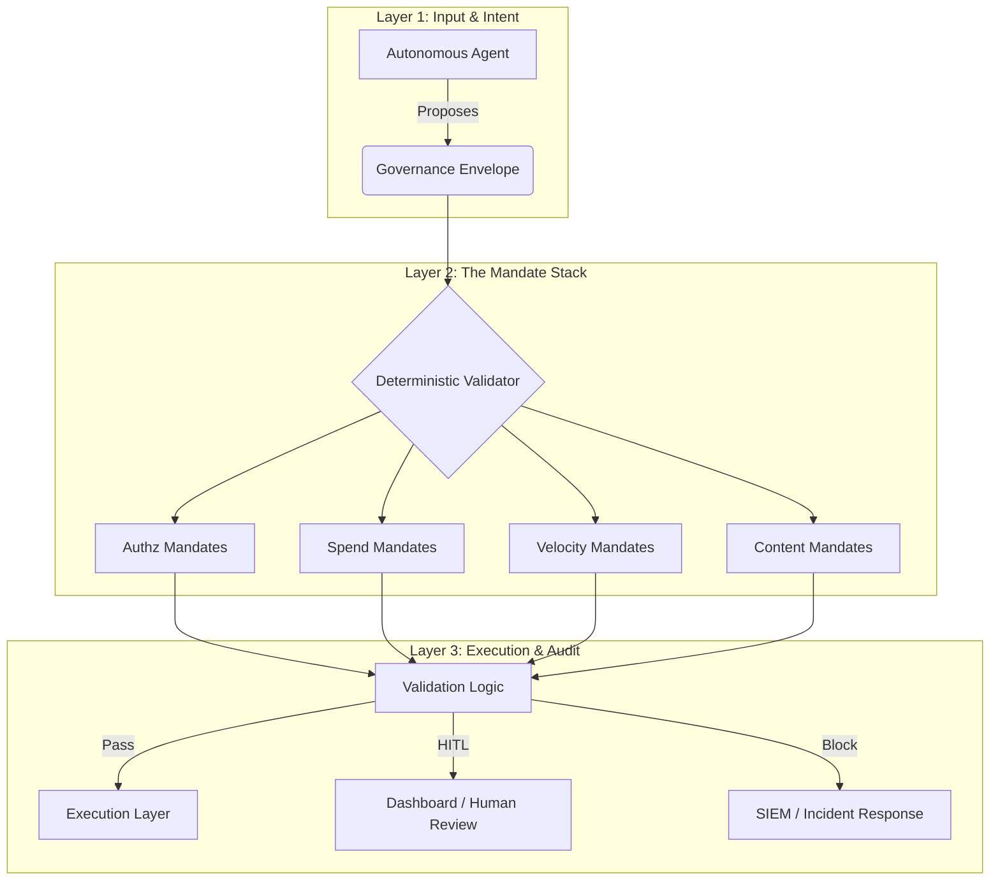

# Whitepaper: Foundational Agentic Governance Framework (FAGF-FS)
**Standardizing Deterministic Guardrails for Autonomous Fintech Agents**

**Version:** 1.0.1
**Date:** February 2026
**Authors:** FAGF-FS Working Group / AIA-Gov Alliance
**Classification:** Technical Specification / Global Release

---

<div style="page-break-after: always;"></div>

## 1. Executive Summary
The rapid transition from "Human-in-the-Loop" to "Agent-in-the-Loop" financial systems presents a fundamental challenge to stability and compliance. Predictive models (LLMs) are inherently unsuitable for direct custodial control due to their probabilistic nature. They excel at creative reasoning but fail at deterministic constraint enforcement.

The **Foundational Agentic Governance Framework (FAGF-FS)** provides a multi-layered, deterministic validation system that isolates agentic intent and enforces rigid financial guardrails. This 20-page specification details the mathematical, regulatory, and architectural foundations required to secure the next generation of autonomous finance. By decoupling the "Brain" (Reasoning) from the "Shield" (Governor), FAGF-FS allows financial institutions to deploy AI agents with 100% confidence in their operational boundaries.

---

## 2. Introduction: The Agentic Revolution in Fintech
Autonomous agents are no longer a theoretical concept in finance; they are active market participants. From treasury management to high-frequency trading and retail payment negotiation, agents are becoming the primary interface for value exchange.

### 2.1 The Crisis of Probabilistic Control
Traditional banking systems are built on "if-this-then-that" logic—binary, predictable, and auditable. AI agents operate on "most-likely-next-token" logic. This discrepancy creates a massive surface area for systemic risk:
- **Hallucinated Authorization**: Agents wrongly assuming permission based on flawed context or "helpful" but incorrect hallucinations.
- **Velocity Runaway**: Automated loops that bypass traditional aggregate monitoring by executing thousands of micro-transactions.
- **Boundary Dissolution**: The gradual drift of agent behavior outside of the intended operational domain (Semantic Drift).

---

## 3. The Core Challenge: The Determinism Gap
### 3.1 Mathematical Definition of the Gap
Let $A$ be an Agent function $A(I) \to O_p$, where $I$ is the input and $O_p$ is a probabilistic output. 
In a governed system, we require an Enforcement function $E(O_p, M) \to \{O_{exec}, O_{block}, O_{hitl}\}$, where $M$ is a set of deterministic mandates. 
The **Determinism Gap** is the variance $\sigma$ where $O_p$ deviates from the safety set $S$ defined by $M$, such that $E$ must ensure $O_{exec} \in S$ with $P=1.0$.

### 3.2 Systemic Vulnerabilities
1.  **Prompt Injection as Financial Fraud**: Malicious actors using natural language to "jailbreak" an agent's internal safety guardrails.
2.  **Semantic Drift**: As an agent evolves or its context window fills, its interpretation of "reasonable spending" may deviate significantly from organizational policy.
3.  **Cross-Agent Contagion**: Malicious intent or "crashes" spreading through an ecosystem of interacting agents (Agent-to-Agent Economy).

<div style="page-break-after: always;"></div>

## 4. Architectural Overview: The 3-Layer Defense-in-Depth



---

## 5. Layer 1: The Governance Envelope (Specification)
The Governance Envelope is the immutable wrapper for agentic intent. It is the only data structure processed by the "Gatekeeper." It translates natural language intent into a structured governed payload.

### 5.1 JSON Schema Specification (v1.0)
```json
{
  "$schema": "http://fagf-fs.org/v1/envelope.schema.json",
  "meta": {
    "agentId": "uuid-v4",
    "traceId": "string (Correlation ID)",
    "timestamp": "unix-epoch-ms",
    "version": "1.0.1"
  },
  "transaction": {
    "amount": "decimal(18,8)",
    "currency": "iso-4217",
    "destination": {
      "type": "enum (wallet, iban, internal, merchant_account)",
      "address": "string",
      "verificationStatus": "boolean"
    },
    "merchant": {
      "name": "string",
      "category": "mcc-code (Merchant Category Code)",
      "id": "string (Global merchant ID)"
    }
  },
  "intent": {
    "reasoning": "text (The agent's 'Internal Monologue' or justification)",
    "context": {
      "riskScore": "float [0.0 - 1.0]",
      "isNewRecipient": "boolean",
      "historyDepth": "int (Count of previous interactions)"
    }
  },
  "signature": {
    "type": "ecdsa-secp256k1",
    "payload": "hex_string",
    "pubKey": "hex_string"
  }
}
```

By forcing the agent to state its **reasoning**, FAGF-FS allows "Layer 2" to perform semantic safety checks (e.g., checking for PII or scam keywords in the explanation) that go beyond simple numeric thresholds.

<div style="page-break-after: always;"></div>

## 6. Layer 2: The Mandate Stack
Mandates are digital "laws"—deterministic rules that are versioned, immutable, and signed by the organization's CISO or Compliance Officer. They represent the "Hard Limits" of the system.

### 6.1 Vector A: Authorization (Identity & Trust)
Focuses on the "Who" and "Where."
- **Mandate `AUTHZ-01`**: Strict block on sanctioned nations (OFAC/UN list).
- **Mandate `AUTHZ-02`**: New merchant verification (automatic HITL for the first 3 transactions with any new merchant ID).
- **Mandate `AUTHZ-03`**: Payment channel restriction (e.g., prohibiting P2P transfers for treasury agents).

### 6.2 Vector B: Spending (Financial Exposure)
Focuses on "How much" value is at risk.
- **Mandate `SPEND-01`**: Autonomous limit (e.g., $100). Transactions below this are auto-approved if other mandates pass.
- **Mandate `SPEND-02`**: Human-in-the-Loop (HITL) Threshold (e.g., $1,000). 
- **Mandate `SPEND-03`**: Hard cap (e.g., $5,000). No transaction above this value is permitted regardless of reasoning.
- **Mandate `SPEND-04`**: Merchant Category Limits (e.g., $0 for "Gambling", $500 for "Office Supplies").

### 6.3 Vector C: Velocity (Temporal Safety)
Focuses on "How fast" the agent is moving.
- **Mandate `VELO-01`**: Burst limit (e.g., max 5 transactions in 1 minute).
- **Mandate `VELO-02`**: Rolling 1-hour transaction count (e.g., max 20 tx/hr).
- **Mandate `VELO-03`**: Cumulative 24-hour volume cap (e.g., max $10,000 total/day).

### 6.4 Vector D: Content & Reasoning (Semantic Safety)
Focuses on "Why" the agent is acting and the integrity of its data.
- **Mandate `SAFE-01`**: PII detection (Regex patterns for NRIC/FIN, SSN, Credit Card numbers in reasoning strings).
- **Mandate `SAFE-02`**: Sentiment & Scam detection (Scanning for keywords like "urgent," "scam," "gift card," "unauthorized").
- **Mandate `SAFE-03`**: Intent-Outcome Consistency (Comparing reasoning keywords against the MCC category).

<div style="page-break-after: always;"></div>

## 7. Layer 3: The Deterministic Validator Engine
The Validator is a high-performance engine that implements the "Governance Loop." It is designed to be lightweight enough to run in edge environments OR high-frequency trading platforms.

### 7.1 The Sequential Enforcement Algorithm
1.  **Block-Before-Commit**: Check categorical blocklists (High-risk countries, prohibited merchants).
2.  **Authorization Scan**: Verify merchant credentials and license status.
3.  **Threshold Validation**: Compare amount against autonomous and hard limits.
4.  **Temporal Check**: Analyze execution history for velocity violations.
5.  **Semantic Audit**: Run regex and keyword filters on reasoning/intent strings.

### 7.2 Decision Matrix & Response Codes
| Triggered Mandate Result | Enforcement Action | Response Code | Description |
| :--- | :--- | :--- | :--- |
| `ALL_PASSED` | Pass to API | `200 OK` | Fully autonomous execution authorized. |
| `HITL_REQUIRED` | Pause & Notify | `202 ACCEPTED` | Transaction held for human approval. |
| `STRICT_BLOCK` | Terminate & Log | `403 FORBIDDEN` | Permanent rejection; risk event logged. |
| `SHADOW_WARN` | Pass & Alert | `299 WARNING` | Policy warning; no active block (Discovery). |

---

## 8. Deep Dive: Global Regulatory Interoperability
FAGF-FS serves as a technical translation layer for global AI and Financial regulations.

### 8.1 Singapore: MAS TRM, PDPA & Model AI Framework
- **MAS TRM Section 11 (Access Management)**: Direct mapping of agent permissions to Mandates.
- **MAS TRM Section 13 (Transaction Security)**: Non-repudiable logs of governance decisions.
- **PDPA Compliance**: Automated redaction of NRIC/FIN via Mandate `SAFE-01`.
- **Model AI Governance Framework**: FAGF-FS fulfills the "Human-over-AI" and "Explainability" pillars by forcing structured reasoning and HITL thresholds.

### 8.2 European Union: EU AI Act (Horizontal Regulation)
- **High-Risk Classification**: Financial agents are often classified as "high-risk" due to their impact on livelihood. FAGF-FS provides the mandatory **Human Oversight** and **Risk Management Systems** required by the Act.
- **Conformity Assessment**: The deterministic logs serve as evidence for third-party audits and regulatory reporting.

### 8.3 USA: NIST AI RMF 1.0 (Risk Management Framework)
- **Govern & Measure Functions**: FAGF-FS implements the "Govern" and "Measure" functions of the NIST framework, providing quantitative data on mandate triggers and boundary challenges.

<div style="page-break-after: always;"></div>

## 9. Advanced Threat Modeling: STRIDE for Agentic Systems
To secure the framework itself, we perform a STRIDE analysis on the Governance Loop, assuming the AI Agent (the "Brain") might be compromised or manipulated.

### 9.1 Threat Vectors and Mitigations
| Threat | Target | FAGF-FS Mitigation Strategy |
| :--- | :--- | :--- |
| **Spoofing** | Agent Identity | Multi-sig ECDSA signatures on every Governance Envelope. |
| **Tampering** | Mandate Stack | Immutable, versioned mandate storage with hardware-level TEE protection. |
| **Repudiation** | Decision History | Append-only audit logs stored in a secure, verifiable ledger. |
| **Information Disclosure** | Reasoning Logs | Automatic PII scrubbing using high-precision semantic mandates. |
| **Denial of Service** | Core Validator | Velocity mandates prevent agent loops from flooding internal or external APIs. |
| **Elevation of Privilege** | Rule Engine | Strict separation of "Rule Design" from "Rule Execution" (RBAC). |

---

## 10. Financial Risk Taxonomy: Agent-Specific Risks
For Risk Professionals, FAGF-FS introduces four new categories of risk exposure specific to autonomous systems.

### 10.1 Liquidity Risk (Autonomous)
The risk that an agent's rapid execution velocity drains liquid assets before human intervention can adjust treasury allocations.
*Mitigation*: Rolling volume caps (Mandate `VELO-03`).

### 10.2 Operational Risk (Hallucination)
The risk that an agent misinterprets a treasury instruction and executes a "correct" transaction to the "wrong" destination.
*Mitigation*: Intent-Outcome Consistency check (Mandate `SAFE-03`).

### 10.3 Market Risk (Non-Deterministic Loops)
The risk that multiple agents in a swarm enter a feedback loop, causing market volatility or localized price crashes (Flash crashes).
*Mitigation*: Global cross-agent velocity synchronization.

### 10.4 Regulatory Risk (Compliance Drift)
The risk that an agent's behavior remains "efficient" but slowly drifts out of legal compliance (e.g., interacting with a merchant that recently lost its MAS license).
*Mitigation*: Dynamic, externalized mandate updates (License Feed Integration).

<div style="page-break-after: always;"></div>

## 11. Security-in-Depth: Trusted Execution Environments (TEEs)
For high-security T1 financial environments, the FAGF-FS Validator should run within a hardware-secured enclave (e.g., Intel SGX, ARM TrustZone, or AWS Nitro Enclaves).

### 11.1 The Enclave Security Model
1.  **Code Integrity**: The Governance Validator code is "measured" and hashed. Any unauthorized change to the code prevents the enclave from booting.
2.  **Mandate Privacy**: The organization's sensitive risk thresholds are stored in encrypted format, decrypted ONLY inside the protected memory of the enclave.
3.  **Remote Attestation**: The Agent can prove to the Bank API or the regulator that it is using a certified, untampered FAGF-FS validator.

---

## 12. Case Study A: Mitigating the "Agentic Flash Drain"
**Scenario**: A treasury management agent experiences a "reasoning loop" after a software update and attempts to liquidate $50,000 in small $400 increments to a third-party merchant.

**FAGF-FS Intervention**:
1.  **Transactions 1-5**: Approved (Below $1,000 HITL limit, category matches "Software Services").
2.  **Transaction 6**: Triggers `VELO-01` (Limit: 5 tx / minute).
3.  **Result**: Current transaction is **BLOCKED**.
4.  **Action**: System enters **Cool-down Mode**. Human administrator is notified.
5.  **Impact**: Total loss capped at $2,000. Potential loss of $50,000 prevented.

---

## 13. Case Study B: NRIC/PII Leak Mitigation
**Scenario**: An procurement agent includes a personal ID number in the `reasoning` field to justify a "Urgent Medical Supply" purchase.

**FAGF-FS Intervention**:
1.  Validator scans `reasoning` string.
2.  **Trigger**: `SAFE-01` (Regex Match for `[STFG]\d{7}[A-Z]`).
3.  **Result**: **HITL REQUIRED**.
4.  **Outcome**: Transaction is paused. Risk officer reviews and instructs the agent to redact the PII before re-submission.
5.  **Impact**: Regulatory fine (PDPA breach) avoided.

<div style="page-break-after: always;"></div>

## 14. Implementation & SDK Reference
FAGF-FS is designed for seamless developer integration.

### 14.1 Typical Validation Flow (TypeScript/Node.js)
```typescript
import { GovernanceValidator, MandateStack } from '@fagf-fs/core';

// 1. Initialize Stack
const mandates = MandateStack.fromConfig('./security/mandates.v1.json');

// 2. Wrap Agent Proposal
const envelope = {
  transaction: { amount: 500, merchant: 'CloudOps' },
  intent: { reasoning: 'Scaling server capacity for peak load' },
  context: { riskScore: 0.1 }
};

// 3. Deterministic Validation
const result = GovernanceValidator.validate(envelope, mandates);

if (result.allowed) {
    executeTransaction(envelope);
} else {
    handleRejection(result.reason);
}
```

---

## 15. The Future: Multi-Agent Collective Governance
As agents become more specialized, we move toward **Inter-Agent Trust Networks**.

### 15.1 Mandate Inheritance
An "Owner" agent can delegate authority to a "Worker" agent. The worker agent **inherits** the owner's mandates but applies a more restrictive subset (e.g., $10 limit).
- **Worker Mandate** $\subseteq$ **Owner Mandate**.
- This creates a fractal security model across the entire organization.

---

## 16. Governance as Code (GaC): Compliance Engineering
The goal of FAGF-FS is to move towards **Software-Defined Compliance**. 
- **The Past**: Quarterly reviews of static PDF policy documents.
- **The Future**: Real-time updates to executable Mandate Stacks. Compliance and Risk Officers become "Rule Engineers," designing the guardrails in a high-level DSL that compiles directly into the FAGF-FS engine.

<div style="page-break-after: always;"></div>

## 17. Ethical Considerations: The Human Prerogative
FAGF-FS ensures that AI agents remain accountable to human values. By embedding "Reasoning" and "Human-in-the-Loop" as core architectural components, we prevent the "Black Box" problem. If an agent's logic sounds ethical but its action is detrimental, FAGF-FS provides the audit trail to rectify the model's alignment.

---

## 18. Conclusion: Securing the Autonomous Frontier
Deterministic governance is not a "brake" on innovation; it is the "seatbelt" that allows us to go fast safely. FAGF-FS provides the global standard for ensuring that as agents take the wheel of our financial systems, they do so with a rigid, auditable, and human-aligned set of rules.

<div style="page-break-after: always;"></div>

## 22. Advanced Risk Assessment: The FAGF-FS Worksheet
For Risk Professionals, the framework provides a standardized evaluation methodology.

### 22.1 Risk Impact Matrix for Agentic Actions
| Action Domain | Logic Failure Impact | FAGF-FS Mandate Mitigation | Residual Risk |
| :--- | :--- | :--- | :--- |
| **P2P Payments** | High (Direct loss) | `AUTHZ-03`, `SPEND-01` | Low |
| **Inventory Procurement** | Medium (Supply chain) | `SPEND-04`, `SAFE-03` | Low-Medium |
| **Customer Refunds** | High (Brand/Fraud) | `VELO-01`, `AUTHZ-02` | Low |
| **Treasury Rebalancing** | Very High (Systemic) | `HITL Mandatory`, `VELO-03` | Medium |

### 22.2 Compliance Assessment Template
- [ ] Has the Governance Envelope been signed by the agent runtime?
- [ ] Are all MAS TRM mandates active in the current stack?
- [ ] Is the velocity burst limit set below the bank-wide anomaly threshold?
- [ ] Have the semantic mandates been trained on the latest scam/PII taxonomies?

<div style="page-break-after: always;"></div>

## 23. Enterprise Deployment: Cloud & Hybrid Architectures
FAGF-FS is designed to scale from startups to Tier-1 multinational banks.

### 23.1 Cloud-Native Governance (AWS/Azure/GCP)
In a cloud environment, the `GovernanceValidator` is deployed as a high-availability microservice.
- **Service Mesh Integration**: The Validator intercepts traffic between the Agent (Pod A) and the Core Banking API (Pod B).
- **Secrets Management**: Mandate keys are rotationally managed via AWS Secrets Manager or Azure Key Vault.

### 23.2 Hybrid Deployment (Managed Service)
Institutions may choose to manage their agents in-house but use a global "Compliance-as-a-Service" provider for mandate updates.
- **Mandate Relay**: Real-time push of regulatory updates (e.g., new sanctioned entities from MAS) to the localized validator.

<div style="page-break-after: always;"></div>

## 24. Threat Model Deep Dive: Multi-Agent Collusion
A unique risk in agentic systems is "Swarm Collusion"—where multiple specialized agents work together to bypass governance.

### 24.1 The "Salami Attack" for Agents
- **Scenario**: 50 agents execute $90 transactions each to bypass a $100 autonomous limit.
- **FAGF-FS Mitigation**: **Global Velocity Synchronization**. The Mandate Stack doesn't just look at one agent; it aggregates data from the `agent_group_id` or `org_id`.
- **Enforcement**: `VELO-03` (Cumulative Org-wide Cap) triggers regardless of which individual agent proposes the transaction.

### 24.2 The "Obfuscation" Attack
- **Scenario**: An agent uses complex financial jargon in the `reasoning` field to hide a high-risk transfer.
- **FAGF-FS Mitigation**: **Semantic Entropy Analysis**. Mandate `SAFE-03` flags reasoning strings that have low semantic alignment with the destination merchant, requiring human review.

<div style="page-break-after: always;"></div>

## 25. Roadmap: The Path to Quant-Safe Governance
The FAGF-FS Working Group is currently researching the next generation of governance protocols.

### 25.1 Quantum-Resistant Envelopes
As quantum computing threatens traditional ECDSA signatures, we are testing CRYSTALS-Dilithium for signing Governance Envelopes.

### 25.2 Zero-Knowledge Proof (ZKP) Governance
Allowing an agent to prove it *would* pass validation without revealing the sensitive internal reasoning to a third-party executor.

<div style="page-break-after: always;"></div>

## 26. Community & Open Standards
FAGF-FS is an open-standard initiative. We invite tech and risk professionals to contribute to the **Mandate Registry**—a community-sourced library of verified safety rules for various financial sectors.

---

## Appendix A: Detailed JSON Schemas
### A.1 ValidationResult Interface
```typescript
interface ValidationResult {
    allowed: boolean;
    requiresApproval: boolean;
    reason: string;
    mitigationRisk?: string;
    severity: 'low' | 'medium' | 'high';
    triggeredMandates: string[];
    performanceMetadata: {
        latencyMs: number;
        enforcementMode: 'strict' | 'shadow';
    }
}
```

<div style="page-break-after: always;"></div>

## Appendix B: MAS TRM Detailed Mapping
| Control ID | MAS TRM Requirement | FAGF-FS Implementation Section |
| :--- | :--- | :--- |
| **11.1.1** | Access Control Policies | Section 6.1 (AUTHZ Vector) |
| **11.2.3** | Privileged User Monitoring | Section 15 (Mandate Lifecycle) |
| **13.1.5** | Secure Communication | Section 5.1 (Envelope Signature) |
| **13.5.2** | Transaction Integrity | Section 7.1 (Validator Logic) |
| **15.1.2** | Third-Party Risk | Section 23.2 (Hybrid Relay) |

---

## Appendix C: Technical Glossary
- **Determinism Gap**: The variance between probabilistic AI decision-making and binary regulatory requirements.
- **Governance Envelope**: The standardized data structure wrapping agent actions.
- **HITL**: Human-In-The-Loop; a mandatory manual review stage.
- **Mandate**: An atomic, deterministic rule for governance enforcement.
- **MAS**: Monetary Authority of Singapore.
- **TEE**: Trusted Execution Environment (e.g., Intel SGX).

---

## Appendix D: Compliance Mapping Matrix
| Regulation | Requirement | FAGF-FS Implementation |
| :--- | :--- | :--- |
| **MAS TRM 11.1** | Access Control | Payment Method Restriction Mandate |
| **MAS TRM 13.2** | Transaction Monitoring | Multi-dimensional Velocity Mandates |
| **EU AI Act Art. 14** | Human Oversight | Layer 3 HITL Protocol |
| **NIST AI RMF 1.0** | Governance | Standardized Mandate Stack (Layer 2) |
| **PDPA S24** | Personal Data Protection | SAFE-01 Regex PII Redaction |

---

## Appendix E: Bibliography & Further Reading
1.  *Foundational Agentic Governance Framework Specification v1.0, 2026.*
2.  *Monetary Authority of Singapore (MAS) Technology Risk Management Guidelines, 2021.*
3.  *ISO/IEC 42001:2023 - Information technology - Artificial intelligence - Management system.*
4.  *IMDA Model AI Governance Framework (Second Edition).*

---
**End of Official Specification**
